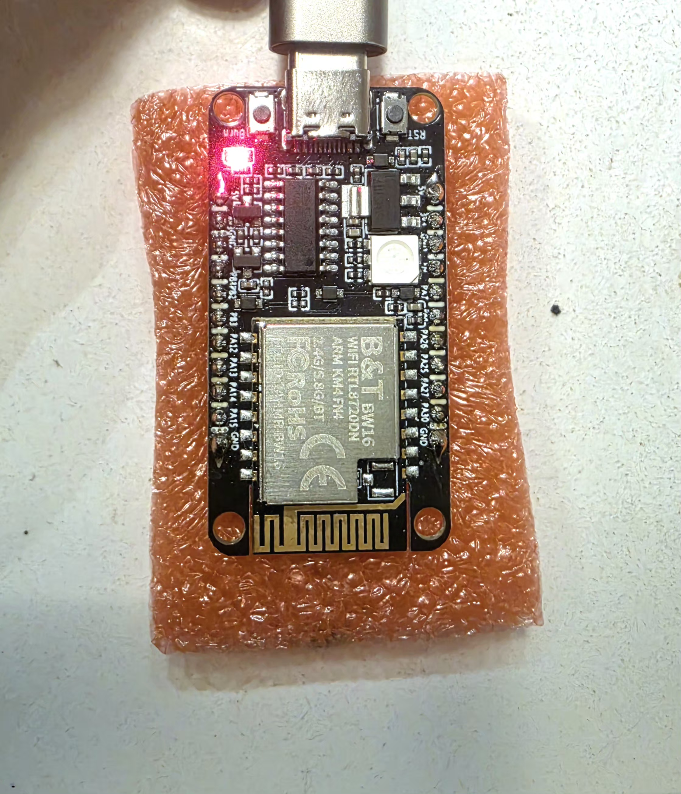

<div align="center">
  
</div>

# Project Dolos
# Building a 5GHz WiFi Spoofer with the Realtek RTL8720dn

When testing rogue access point (AP) detection and anti-spoofing systems, having a versatile tool to simulate complex RF environments is invaluable. This post explores the technical details of a custom 5GHz WiFi AP Spoofer built using the Realtek RTL8720dn microcontroller.

> [!CAUTION]
> This tool broadcasts raw 802.11 frames and is intended **strictly for authorized testing** on networks and devices you own.

> [!WARNING]
> **Liability Disclaimer:** This project is provided for educational and research purposes only. The creator(s) and contributor(s) accept no liability and are not responsible for any misuse, damage, or legal consequences caused by using this code or hardware. Users are fully responsible for ensuring their actions comply with all applicable local, state, and federal laws.

## Use Cases
Before diving into the code, here is what makes a dedicated 5GHz spoofer so powerful:

- **Geolocation API (LBS) Interference**: Exploiting how Android and iOS devices rely heavily on Wi-Fi BSSID scanning for their Location-Based Services. By broadcasting a flood of specific spoofed BSSIDs that databases correlate with different physical locations, this tool can create a digital "labyrinth," confusing mapping algorithms and manipulating a device's perceived location.
- **Security Audits**: Verifying whether Wireless Intrusion Prevention Systems (WIPS) or Enterprise controllers correctly identify unauthorized APs mimicking corporate networks on 5GHz spectrums.
- **Client Fallback Testing**: Testing how client mobile devices handle roaming and BSSID transitions when presented with identical fake APs using different security standards (e.g. forced degradation from WPA3 to Open).
- **Beacon Flooding & Stress Testing**: Generating hundreds of randomized 5GHz APs to overwhelm client OS network managers, Wi-Fi scanners, or monitoring tools, testing their resilience against beacon exhaustion and interface freezing.

## The Hardware: RTL8720dn (BW16)
While the ESP8266 and ESP32 are famous for their 2.4GHz WiFi hacking capabilities (like the original ESP8266 Deauther), they lack 5GHz capable radios. The Realtek RTL8720dn (often found on dual-band BW16 modules) bridges this gap. It's an affordable SoC featuring dual-band WiFi (2.4GHz & 5GHz), making it the perfect compact platform for 5GHz packet injection and AP spoofing.

## How the Spoofer Works
The objective of this tool is to simulate the presence of multiple 5GHz access points simultaneously. It achieves this by crafting strict 802.11a beacon frames in software and utilizing the AmebaD SDK's packet injection capability to broadcast them over the air.

### Defining the Fake Networks 
The tool manages an array of `SpoofAP` objects, allowing users to define fully customized fake access points. You can set the SSID, MAC address (BSSID), 5GHz channel, and security profile (Open, WPA2, or WPA3).

```cpp
struct SpoofAP {
  const char   *ssid;
  uint8_t       channel;
  uint8_t       bssid[6];
  WiFiSecurity  security;  // AP_SEC_OPEN, AP_SEC_WPA2, or AP_SEC_WPA3
};
```

### Crafting Raw 802.11 Beacons from Scratch
Because we are heavily customizing the beacons (e.g., faking WPA3 networks on a chip that might not natively run a full hardware WPA3 AP stack), the firmware builds the entire MAC frame byte-by-byte.

The `build_beacon_5g` function constructs the frame structure:
1. **MAC Header & Destination**: Setting the source and BSSID to the spoofed address, and broadcasting to `FF:FF:FF:FF:FF:FF`.
2. **Fixed Fields**: Setting the Timestamp and a fixed Beacon Interval of 100 Time Units (TUs) or ~102.4ms (the 802.11 standard).
3. **Information Elements (IEs)**: This is where the magic happens. We append tags for:
   - **SSID** (Tag 0)
   - **Supported Rates** (Tag 1 & 50): Since it's 5GHz, it requires OFDM rates without 2.4GHz DSSS fallbacks. 
   - **DS Parameter Set** (Tag 3): Emits the current channel, which is heavily relied upon by iOS/Android active scanning algorithms.
   - **HT Capabilities & Operation** (Tag 45 & 61): Ensures modern devices recognize the network as 802.11n compatible.
   - **RSN (Robust Security Network)** (Tag 48): Setting up the cryptographic capabilities. If spoofing WPA2, it advertises PSK (Pre-Shared Key) and CCMP. If spoofing WPA3, it advertises SAE (Simultaneous Authentication of Equals) and mandatory Management Frame Protection (MFP).

### Time-Sliced Transmission
Broadcasting multiple networks on a single radio simultaneously requires precise timing. The 802.11 specification mandates that beacons typically fire every ~102.4ms. 

Instead of trying to start multiple AP interfaces, the script uses a time-sliced "burst" loop:
```cpp
#define SLOT_US 10000UL // 10ms per AP slot
// ...
void loop() {
  for (int i = 0; i < (int)NUM_SPOOF_APS; i++) {
    // Burst packets for the current AP
    for (int b = 0; b < BEACON_BURST_COUNT; b++) {
      wifi_tx_raw_frame(beacon_buf, frame_len);
    }
    // Idle until the 10ms slot completes
  }
}
```

This ensures that all spoofed APs broadcast their beacons within the "passive scan dwell time" of client devices. An Android device typically listens on a single channel for 60-90ms. By rotating through all our AP beacons within 50ms (for 5 APs), we guarantee that any listening target device picks up the entire spoofed list in a single scan phase perfectly.

The RTL8720dn opens up a new realm of hardware network testing formerly reserved for full Linux-based SDRs or heavily modified PCIe wireless interfaces. By dropping down to barebones buffer manipulation, we get an incredibly powerful 5GHz protocol tester that runs efficiently off a simple USB battery bank.


### Update

Iphone uses advanced sensor fusion algorithm to detect the indoor location. you need to move your phone to have the location updated.

Using HackRF One to simulate the L1 GPS signal will significantly increase the chance to get location spoofed for iPhone.

###
## Hardware


